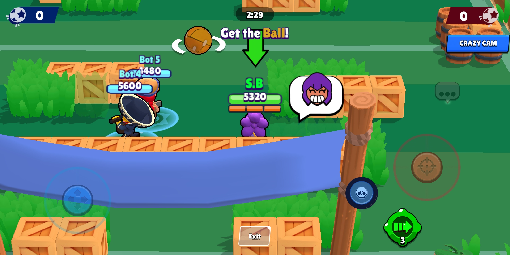

# cpp-brawl
First Brawl Stars v29 open source private server made in c++! 

# how2play
[download the apk from here](https://www.mediafire.com/file/366j54deggto6nj/cpp-brawl.apk/file) 

for Android, install cxxdroid from playstore, open Program.cpp and run it

for Pc or others, compile it then run it

after running the code, open the apk and have fun! 
# remark
this is a sample server that I made while learning c++, basically it is a server base.
it's whole code is written by me except for [CsvHelper.h](https://github.com/ben-strasser/fast-cpp-csv-parser) 

I made my best to only use built in libraries
# any questions? 
if you have any question, feel free to ask me in my [discord server](https://discord.gg/b2ejYcJjqA)
